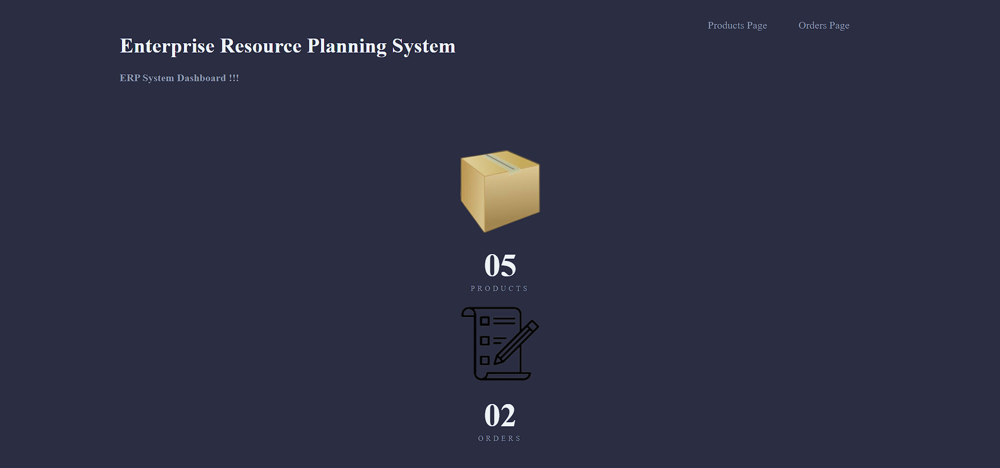
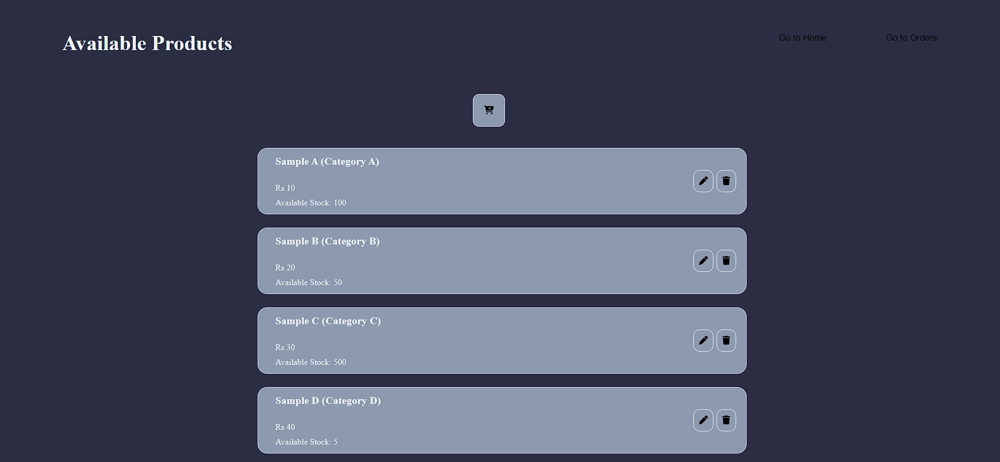
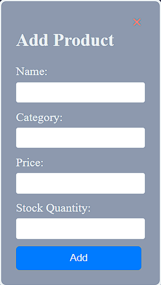
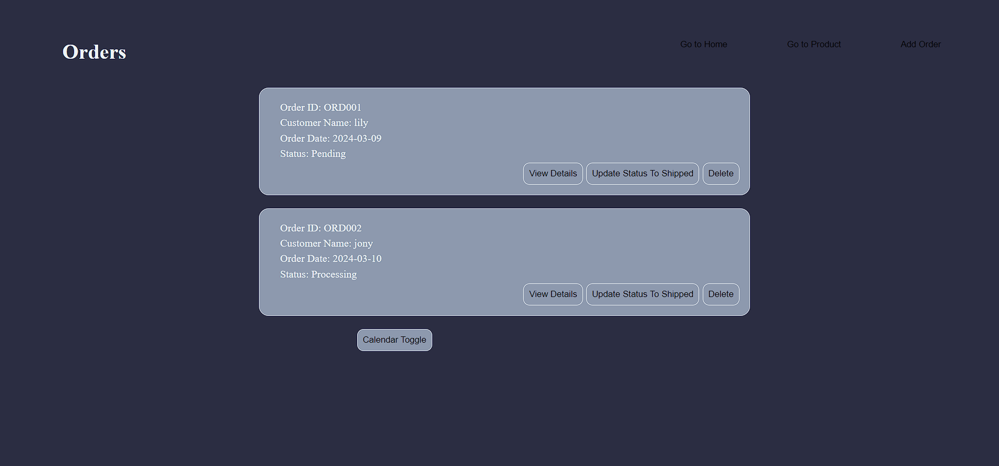
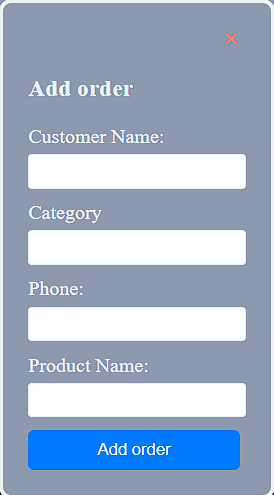

# ERP-SYSTEM
# ERP System with React

This project is focused on developing a streamlined interface for an ERP (Enterprise Resource Planning) system using React. The system is designed to handle product and order management, along with providing an intuitive dashboard overview. Additionally, it offers an optional feature for visualizing orders through a calendar view.

## Project Overview

The ERP system consists of the following pages:

- **Dashboard:** Provides an overview of features and allows quick navigation to the Products and Orders management pages.
- **Products Management:** Here, users can efficiently handle product listings, with options to add, modify, or remove products as needed.
- **Orders Management:**  This segment streamlines the viewing and management of orders, providing functionalities to delve into order specifics, update statuses, and remove orders when necessary.
- **Orders Calendar View:** Implemented within the Orders Page, this feature presents a visual representation of orders based on their expected delivery dates. Users can effortlessly navigate through the calendar to view orders scheduled for any given day.

## Objectives

-Centralize data for consistency and accuracy.
-Increase visibility into business operations.
-Enhance customer service by understanding preferences.
-Provide a user-friendly interface for easy adoption and usage.

## Technology Stack

- React

## Documentation

### Running the Application

To run the application locally, follow these steps:

1. Clone the repository to your local Device:

   git clone https://github.com/Swaraj16x/ERP-SYSTEM.git
   

2. Navigate to the project directory:

    cd ERP-System
  

3. Install dependencies using npm:
  
    npm install
   

4. Start the development server:
   
   npm start
 
   
5. Open your browser and visit `http://localhost:3000` to view the application.

### Screenshots

*Figure 1: Dashboard overview*

*Figure 2: Products management page*

*Figure 3: Orders management page*

*Figure 4: Orders calendar view (optional feature)*

## Project Deployment

The project is deployed on [Netlify](https://swarajsinh-erp-system.netlify.app).

!!! PEACE !!!
